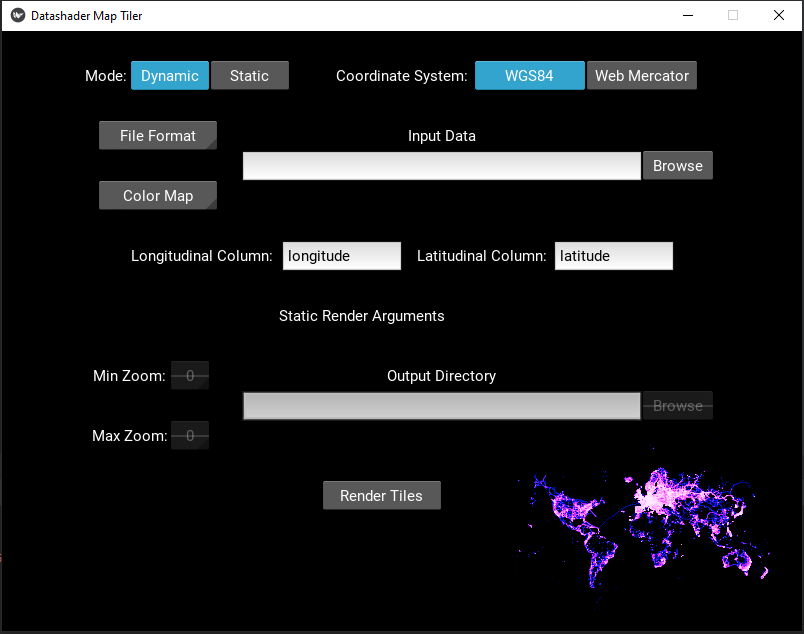

# Datashader Map Tiler

Datashader Map Tiler is a Kivy-based Python application for rendering of large scale geospatial data using [Datashader](https://datashader.org/).

* Mode
    - Dynamic - Opens a browser tab and renders in a Panel dashboard, allowing panning and zooming of the data live.
    - Static - Renders a full TMS tileset to disk that can be hosted and used by web map frameworks such as Leaflet.
* Coordinate System
    - WGS84
    - Web Mercator
* File Format
    - CSV - 
    - Parquet - Can be either a single parquet file, or a directory of partitioned parquet data.
* Input Data
* Color Map - Using the [Colorcet Linear Colormaps](https://colorcet.holoviz.org/)
* Longitudinal Column - Provide the column name for the longitude in the input data
* Latitudinal Column - Provide the column name for the latitude in the input data
* Min Zoom - The minimum zoom level for the TMS tileset
* Max Zoom - The maximum zoom level for the TMS tileset
* Output Directory - Specify where Datashader Map Tiler should store the TMS tileset